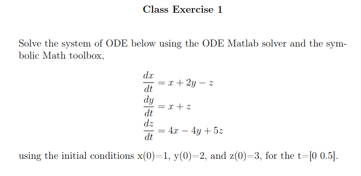
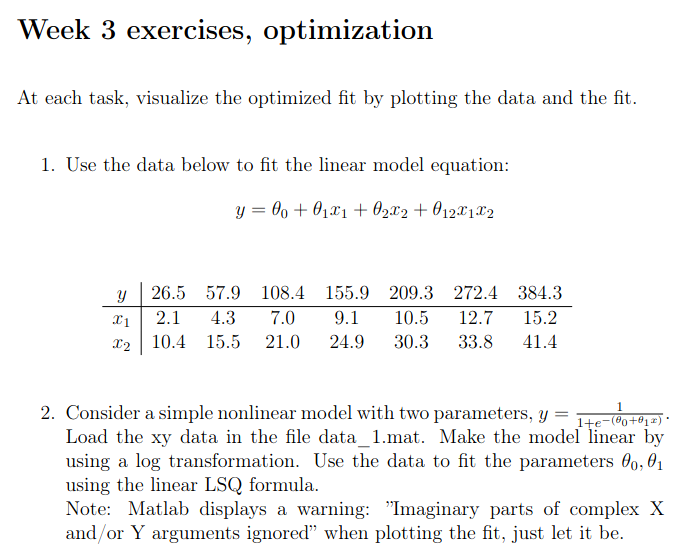
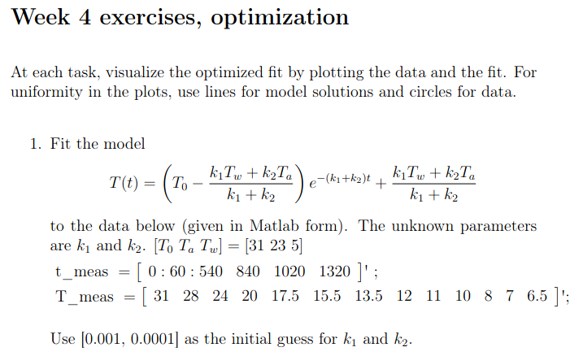
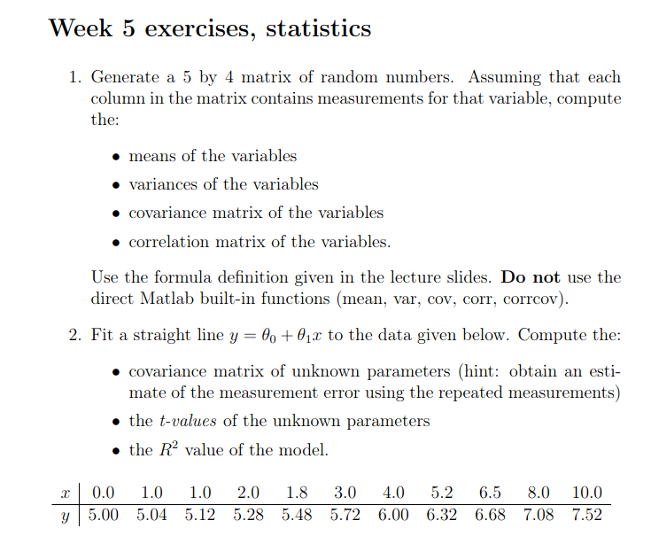

<!-- BANNER START -->

  

<h1 align="center">Principles of Technical Computing</h1>

  <b>Solutions to LUT University's Principles of Technical Computing course</b> 
  <i>MATLAB assignments, optimization, ODEs, statistics, and more</i>

  <a href="#contents">Contents</a> •
  <a href="#description">Description</a> •
  <a href="#course-materials">Course Materials</a>

<!-- BANNER END -->

---

## 📚 Contents

This repository contains weekly assignments for the Principles of Technical Computing course at LUT University. Each week includes a PDF describing the tasks and MATLAB `.m` files with solutions.

- [Week 1](./week1/): <b>Image Compression with SVD</b> 
  
- [Week 2](./week2/): <b>Solving ODEs in MATLAB</b> 
  
- [Week 3](./week3/): <b>Parameter Optimization</b> 
  
- [Week 4](./week4/): <b>Nonlinear Parameter Optimization</b> 
  
- [Week 5](./week5/): <b>Parameter Sensitivity & Statistics</b> 
  

---

## 📝 Description

**Teaching Language:** English  
**Teacher(s) in Charge:** D.Sc. (Tech.) Matylda Jablonska-Sabuka

### Aims
- Gain fluency in MATLAB syntax and programming
- Understand principles of technical computing
- Apply skills to mathematical and engineering problems
- Skills are also applicable to Octave and R

### Topics Covered
- Data structures (multidimensional arrays, cell arrays, etc.)
- Variable types (numeric, logical, textual, etc.)
- Symbolic computation
- Conditional statements (`if-else`, `switch-case`)
- Loops (`for`, `while`)
- Built-in functions
- Handling external data
- 2D/3D plotting
- User-defined functions
- Code optimization (speed, style, efficiency)

### Teaching Methods
- Lectures: 12 h
- Computer class exercises: 24 h
- Independent study: 30 h
- Exam preparation: 34 h
- **Total:** 100 h

### Assessment
- Grading: 0–5
- Examination: 100%
- Exam in Exam system: **Yes**
- Moodle/Exam schedule: **No**

### Prerequisites
- Basic university calculus (including matrix calculus)

### Places
- Exchange students: max 10
- Open University students: max 5

---

## 📖 Course Materials
- Lecture material (available in Moodle)
- Based partly on: Gilat, A.: <i>An Introduction to Matlab with Applications</i>

---

  <i>For questions or suggestions, feel free to open an issue or pull request!</i>

